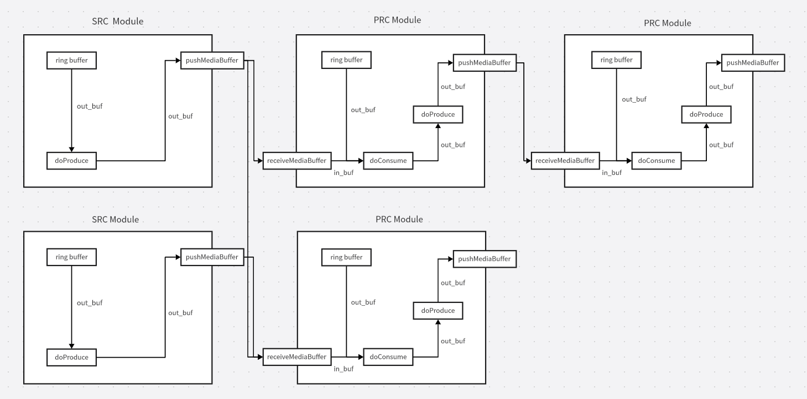

# FFMedia 介绍

FFMedia 是面向 Linux 多媒体应用的模块化音视频处理框架，重点适配 Rockchip 平台的
V4L2、MPP、RGA、DRM/KMS、EGL/GLES、ALSA、FFmpeg 和 RKNN 等能力。框架把采集、读取、
解码、图像处理、推理、编码、显示、封装和推流抽象为可以独立配置、组合和复用的模块，
适合搭建 Camera、文件、网络流和应用内存之间的实时媒体流水线。

FFMedia 的主要特点：

- **模块化管线**：输入（VI）、处理（VP）和输出（VO）模块通过统一接口连接；一个生产者
  可以分发给多个消费者，也可以在同一管线中组合多路输入和输出。
- **硬件加速**：优先使用平台提供的 MPP、RGA、DRM/KMS 和显示后端完成编解码、缩放、
  裁剪、格式转换及显示。
- **共享 Buffer**：媒体数据通过 `std::shared_ptr<MediaBuffer>` 传递。在设备和模块支持时，
  可结合 DMA-BUF 共享底层存储，减少不必要的数据复制；下游持有共享指针即可延长当前帧的
  有效期。
- **统一参数接口**：模块配置由参数系统描述，可在 C++、Python 和命令行中使用相同的参数
  名称、类型和层级进行查询与设置。
- **可扩展**：应用可以直接组合现有模块，也可以继承 `ModuleMedia` 实现自定义数据源、处理
  器或输出模块。

## 模块概览

| 类别 | 模块 | 能力概述 |
| --- | --- | --- |
| VI 输入 | `Camera` | UVC、MIPI CSI 摄像头采集 |
| VI 输入 | `RTSP Client`、`RTMP Client` | 网络拉流或推流输入 |
| VI 输入 | `File Reader`、`Memory Reader` | 文件、裸流和应用内存输入 |
| VI 输入 | `FFmpeg Demux` |  文件、网络流和设备输入 |
| VI 输入 | `Alsa Capture` | ALSA 音频采集 |
| VP 处理 | `MppDec`、`MppEnc` | H.264、H.265、MJPEG、VP8、VP9、MPEG 等视频硬件编解码 |
| VP 处理 | `RGA` | 合成、缩放、裁剪、旋转和像素格式转换 |
| VP 处理 | `Video Stack` | 多路视频拼接后输出 |
| VP 处理 | `AacDec`、`AacEnc` | AAC 音频编解码 |
| VP 处理 | `Inference` | 基于 RKNN 的模型推理 |
| VP 处理 | `ImageProcessor` | 合成、缩放、裁剪、旋转和像素格式转换 |
| VO 输出 | `DRM Display`、`Renderer Video` | DRM/KMS 或窗口后端显示 |
| VO 输出 | `File Writer`、`FFmpeg Mux` | 文件、裸流和网络封装输出 |
| VO 输出 | `RTSP Server`、`RTMP Server`、`GB28181 Client` | 网络服务、推流和 GB28181 输出 |
| VO 输出 | `Alsa PlayBack` | ALSA 音频播放 |

此外，`ModuleAppSource` 和 `ModuleAppProcessor` 可把应用自己的采集、处理逻辑接入同一条
模块管线。按模块列出的运行时依赖请参见
[examples/demo/Readme.md](examples/demo/Readme.md)。

## 典型数据流

```text
Camera / File / RTSP / Memory
              |
        Demux 或 MppDec
              |
       RGA / 推理 / 自定义处理
          /       |        \\
      Display   MppEnc   File/推流
```

在实际使用中可以省略不需要的阶段，例如直接把 Camera 的原始帧送到 DRM 显示，或将编码
输入直接转封装保存。模块启动时由框架管理工作线程、输入队列、输出 Buffer 轮转和下游
连接；正常停止时，输出 Buffer 会在最后一个下游共享引用释放后回收到对应模块。

各个模块成员函数、参数系统和 Buffer 生命周期说明请参看
[docs/ffmedia_api.md](docs/ffmedia_api.md) 及 [docs/module_media.md](docs/module_media.md)。
需要快速运行现成管线时，可使用 C++ 的 `examples/demo/ffmedia.cpp` 或 Python 的
`examples/demo/ffmedia.py` 参数 CLI，入口说明见
[examples/demo/Readme.md](examples/demo/Readme.md)。

## 软件框架

整个框架采用 Producer/Consumer 模型，将各个单元都抽象为 `ModuleMedia`。输入源模块没有
Producer，通过 `doProduce()` 生成数据；处理和输出模块通过 `doConsume()` 接收数据。一个
Producer 可以连接多个 Consumer，一个 Consumer 也可以连接多个 Producer。模块之间传递的
是带媒体类型、时间戳、格式和通道信息的 `MediaBuffer`。

模块连接、初始化、启动停止、Buffer 有效期及派生类开发流程详见
[docs/module_media.md](docs/module_media.md)。


## 示例的编译和运行

发布包中的源码示例统一位于 `examples/`：

- `examples/demo/`：C++/Python Demo；编译和使用方法见
  [examples/demo/Readme.md](examples/demo/Readme.md)。
- `examples/tests/`：CPU 测试与硬件手动测试源码；测试分类、构建和运行方法见
  [examples/tests/README.md](examples/tests/README.md)。
- `examples/inference_examples/`：推理示例。
- `examples/inference/`：独立依赖 FFMedia 发布 SDK 构建的 RKNN 推理扩展、跟踪、OSD 及相关示例；
  构建和使用方法见 [examples/inference/README.md](examples/inference/README.md)。
- `examples/external_module/`：外部模块 ABI 示例。

提供以下构建开关：

- `DEMO_OPENCV`：编译 OpenCV Demo，默认关闭。
- `ENABLE_TESTS`：编译 Tests，默认开启。
- `ENABLE_INFERENCE_EXAMPLES`：编译 `examples/inference_examples/`，默认关闭。
- `ENABLE_INFERENCE_EXTENSION`：编译 `examples/inference/` 中独立依赖 SDK 的推理扩展，默认关闭。

例如编译基础 Demo 和 Tests：

```bash
cmake -S . -B build \
  -DDEMO_OPENCV=OFF \
  -DENABLE_TESTS=ON \
  -DENABLE_INFERENCE_EXAMPLES=OFF
cmake --build build -j
```

如需同时编译推理示例：

```bash
cmake -S . -B build \
  -DENABLE_INFERENCE_EXAMPLES=ON
cmake --build build -j
```

如需从发布包根目录编译独立推理扩展：

```bash
cmake -S . -B build \
  -DENABLE_TESTS=OFF \
  -DENABLE_INFERENCE_EXTENSION=ON
cmake --build build -j
```

也可以直接进入 `examples/inference/` 执行 `cmake -S . -B build`；该目录会自动发现当前发布包的 FFMedia CMake 配置。

## ffmedia api 文档
ffmedia的api详细文档：[docs/ffmedia_api.md](docs/ffmedia_api.md)

## 低延迟显示测试

以下场景均使用ffmedia实现的低负载、高实时性的低延迟显示测试。

- 场景1：HDMI输入转发显示：HDMI画面经过RK3588-A采集、编码、推流后画面延迟为17.5ms（画面帧率越高延迟越低）。画面经过RK3588-B取流、解码、送显后画面延迟为1.5ms。画面只要在vsync来临前1ms设置显示，就可以保证在屏幕的vsync来临后将画面内容显示出来，则估算屏幕显示画面延迟为1ms~17.6ms，取平均10ms。画面从HDMI输入到转发显示的延迟平均为29ms。
- 场景2：Camera采集转发显示：RK3588-A控制LED，再通过Camera采集该画面，经过编码、推流后画面延迟为7.5ms。画面经过RK3588-B取流、解码、送显后画面延迟为1.5ms。屏幕显示画面延迟为1ms~17.6ms，取平均10ms。画面从Camera采集到转发显示的延迟平均为19ms。


### 显示延迟优化

通过上面测试结果可观察到系统整体延迟受显示延迟影响比较大，并存在较大波动。可通过下面方法降低画面显示延迟并将波动范围控制在可接受范围。

1. 由于采集数据的频率固定，每次开启时数据送显时间点与屏幕的vsync时间点差值随机，可能就会遇到较大的差值导致延迟偏高，这时就可以通过reset VideoPort 控制vsync时间点与数据送显时间点接近。
2. 采集数据的帧率与刷新屏幕的帧率不可能完全一致，对于要求低延迟显示来说，可能就会有延迟时间的波动，为了解决这个问题，就需要动态调整屏幕的刷新率，调整hdmitx的 phy clk，dp、edp的v0pll，dsi的aupll 时钟频率，尽可能与数据采集频率趋于一致，让延迟波动控制在可接受范围。

通过以上两步可以让显示延迟从1ms~17.6ms的波动范围降低至1ms~7ms。

## 常见问题

### 依赖库路径问题
程序运行环境区别可能导致寻找不到依赖的动态库，可通过LD_LIBRARY_PATH将库路径添加进当前环境。
```
export LD_LIBRARY_PATH=/path/to/your/libs:$LD_LIBRARY_PATH
```

或者通过patchelf直接修改程序或者动态库的库路径。
```
patchelf --set-rpath /path/to/your/libs <your-binary>
```
### 多路编解码失败问题

在多路编解码时，如果出现无法申请buf或者无法初始化等，可能是进程使用文件描述符数量限制，一般为1024。
更改进程使用的fd数量，临时更改：

```
ulimit -n #查看当前进程可用fd最大数量
ulimit -n 102400 #更改进程可用fd最大数量到102400
```
永久更改：

```
sudo vim /etc/security/limits.conf
#在尾部添加
*	soft	nofile	102400
*	hard	nofile	102400
*	soft	nproc	102400
*	hard	nproc	102400

```

## 其他

如果遇到问题或者有其他功能需求的，可以提issue，我们将在下个版本修复或添加支持。
